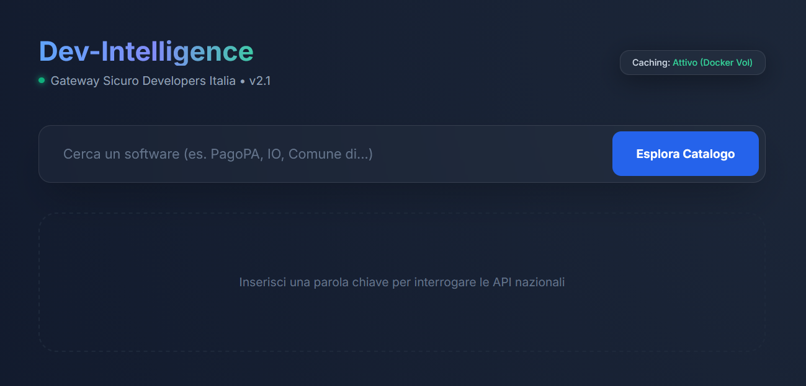

# Dev-Intelligence

> Gateway intelligente e generatore di SDK per l'interoperabilità della Pubblica Amministrazione italiana.

[](https://github.com/RubberDuckOps/dev-intelligence/actions/workflows/ci.yml)
[](https://www.python.org/downloads/)
[](https://fastapi.tiangolo.com)
[](https://www.docker.com)
[](LICENSE)
[](publiccode.yml)



## Indice

- [Stato del progetto](#stato-del-progetto)
- [A cosa serve](#a-cosa-serve)
- [Demo](#demo)
- [Caratteristiche](#caratteristiche)
- [Casi d'uso](#casi-duso)
- [Avvio Rapido](#avvio-rapido)
- [Variabili d'Ambiente](#variabili-dambiente)
- [Struttura del Progetto](#struttura-del-progetto)
- [Architettura](#architettura)
- [Sicurezza](#sicurezza)
- [Test](#test)
- [Comandi Utili](#comandi-utili)
- [Software PA con OAS Documentata](#software-pa-con-oas-documentata)
- [Manutenzione](#manutenzione)
- [Licenza](#licenza)

---

## Stato del progetto

**Stable** — il software è funzionante, testato con 130+ test automatizzati e pronto per l'uso.
Distribuito come immagine Docker containerizzata con hardening di sicurezza completo.

---

Permette agli sviluppatori di esplorare il [catalogo Developers Italia](https://developers.italia.it/), validare le specifiche OpenAPI dei software a riuso e generare codice client tramite un LLM locale (Qwen2.5-Coder-0.5B), il tutto in un'interfaccia sicura e completamente containerizzata.

> **Nota:** questo progetto non è un prodotto ufficiale di Developers Italia, AgID o di alcuna Pubblica Amministrazione. È uno strumento indipendente della community basato sulle API pubbliche di Developers Italia.

---

## A cosa serve

In Italia, la Pubblica Amministrazione mette a disposizione centinaia di software open source riusabili tramite il [catalogo Developers Italia](https://developers.italia.it/). Molti di questi software espongono API REST documentate con specifiche OpenAPI/Swagger — ma trovare il software giusto, capire se la specifica è realmente disponibile e scrivere il codice client per integrarla rimane un lavoro manuale e dispersivo.

**Dev-Intelligence automatizza questo flusso in tre passi:**

1. **Cerca** — digiti un termine (es. `pagamenti`, `identità`, `SPID`, `fattura`) e l'app interroga il catalogo ufficiale, mostrando tutti i software PA corrispondenti con nome, descrizione, linguaggio e link al repository.

2. **Valida** — per ogni software trovato, l'app verifica automaticamente se la specifica OpenAPI è raggiungibile e restituisce un segnale visivo immediato (verde = OAS disponibile, rosso = non raggiungibile, grigio = assente), così sai subito quali software puoi integrare senza scavare nella documentazione.

3. **Genera** — con un click scegli il linguaggio (Python, JavaScript, Go, Rust, Java) e un LLM locale genera un client SDK funzionante, pronto da copiare nel tuo progetto. Il codice include automaticamente gli header di interoperabilità previsti dal Modello di Interoperabilità AgID (`X-Request-Id`, `X-Correlation-Id`). Nessuna chiave API, nessun dato inviato a server esterni: l'inferenza avviene interamente sulla tua macchina.

   > **Attenzione:** il codice generato è un'anteprima funzionale basata su euristiche LLM. Non deve essere usato in produzione senza una revisione manuale e il confronto con gli schemi ufficiali presenti su [schema.gov.it](https://www.schema.gov.it/).

**A chi è utile:**
- Sviluppatori che devono integrare servizi PA (PagoPA, SPID, CIE, PDND, ecc.) e vogliono partire da un client di esempio concreto
- Team di PA che vogliono esplorare cosa è già disponibile a riuso prima di sviluppare da zero
- Chi studia l'ecosistema open source della PA italiana e vuole capire quali API sono realmente attive

> L'app non sostituisce la documentazione ufficiale né garantisce la correttezza delle specifiche esposte dai singoli software. Il codice generato è un punto di partenza, non un prodotto finito.

---

## Demo

<video src=".github/assets/dev-intelligence-usage.mp4" controls muted playsinline width="100%"></video>

---

## Caratteristiche

| Feature | Dettaglio |
|---------|-----------|
| **Ricerca catalogo PA** | Interroga `api.developers.italia.it/v1/software` con filtro testuale locale; cache 24h |
| **Validazione OAS** | HEAD asincrona + protezione SSRF/DNS-rebinding per ogni software trovato |
| **Generazione SDK via LLM** | Qwen2.5-Coder-0.5B-Instruct (GGUF Q4_K_M, ~491 MB) — Python, JS, Go, Rust, Java; header ModI (`X-Request-Id`, `X-Correlation-Id`) inclusi |
| **LLM locale** | Inferenza CPU-only via `llama-cpp-python`; nessuna API esterna, nessun dato inviato fuori |
| **Cache persistente** | `diskcache` su volume Docker: catalogo 24h, metadata, codice generato 24h |
| **Font self-hosted** | Inter + Fira Code serviti localmente (no Google Fonts, GDPR-friendly) |
| **Security hardening** | SSRF, CSP nonce, HSTS, container read-only, cap_drop ALL, supply chain hash |

---

## Casi d'uso

- **Riuso software PA (Art. 69 CAD)** — esplora il catalogo Developers Italia per trovare software riusabile prima di sviluppare da zero
- **Header ModI nei template SDK** — il codice generato include `X-Request-Id` e `X-Correlation-Id` conformi al Modello di Interoperabilità AgID
- **Ricerca servizi PagoPA, IO, PDND** — cerca nel catalogo software relativi a pagamenti, messaggistica e interoperabilità dati
- **Verifica disponibilità OAS** — controlla rapidamente quali software PA hanno una specifica OpenAPI raggiungibile

---

## Avvio Rapido

**Prerequisiti:** Docker e Docker Compose.

```bash
git clone https://github.com/RubberDuckOps/dev-intelligence.git
cd dev-intelligence
cp .env.example .env   # opzionale: personalizza le variabili
docker-compose up --build
```

L'app è disponibile su **http://localhost:8000**.

> Al primo avvio il modello GGUF (~491 MB) viene scaricato automaticamente da HuggingFace Hub in `./models/`.
> I successivi avvii usano la copia locale (build istantanea).

---

## Variabili d'Ambiente

Tutte opzionali — i valori di default sono già impostati per un avvio immediato.

| Variabile | Default | Descrizione |
|-----------|---------|-------------|
| `CACHE_EXPIRE` | `86400` | TTL cache catalogo in secondi (24h) |
| `MAX_CATALOG_PAGES` | `10` | Numero massimo di pagine API da scaricare |
| `DEV_ITALIA_BASE_URL` | `https://api.developers.italia.it/v1` | URL base API Developers Italia |
| `TRUSTED_PROXIES` | `` (vuoto) | IP del reverse proxy per `X-Forwarded-For` (es. `10.0.0.1`) |
| `MODEL_DIR` | `/app/models` | Directory per il modello GGUF |
| `MODEL_REPO` | `Qwen/Qwen2.5-Coder-0.5B-Instruct-GGUF` | Repository HuggingFace del modello |
| `MODEL_FILE` | `qwen2.5-coder-0.5b-instruct-q4_k_m.gguf` | Nome del file GGUF |
| `LLM_N_CTX` | `2048` | Context window del modello |
| `LLM_N_THREADS` | `4` | Thread CPU per l'inferenza |
| `LLM_MAX_TOKENS` | `1024` | Token massimi generati per risposta |
| `LLM_TIMEOUT` | `120` | Timeout inferenza in secondi |
| `SKIP_LLM` | `false` | Se `true`, salta il caricamento del modello (utile nei test CI) |

---

## Struttura del Progetto

```
dev-intelligence/
├── main.py                    # App FastAPI single-file (~700 righe)
├── templates/
│   └── index.html             # SPA: Tailwind CDN + Prism.js + JS puro
├── static/
│   └── fonts/
│       ├── inter-latin.woff2       # Font variabile Inter (pesi 300–700)
│       └── fira-code-latin.woff2   # Font variabile Fira Code (pesi 400–500)
├── tests/
│   ├── test_main.py           # 100+ test pytest
│   └── conftest.py            # Fixture: cache isolata, rate limiter reset
├── .github/
│   └── workflows/
│       └── ci.yml             # CI: build Docker + test con SKIP_LLM=true
├── Dockerfile                 # Multi-stage: builder + runtime (Python 3.12-slim)
├── docker-compose.yml         # Volume cache + models + hardening completo
├── .dockerignore
├── .gitignore
├── publiccode.yml             # Descrittore per il Catalogo del Riuso (Developers Italia)
├── SECURITY.md                # Documentazione sicurezza (SSRF, CSP, hardening)
├── CONTRIBUTING.md            # Guida alla contribuzione
├── requirements.in            # Dipendenze dirette (non pinnate)
├── requirements.txt           # Dipendenze pinnate con SHA256 hash
├── requirements-dev.in        # Dipendenze dev (non pinnate)
├── requirements-dev.txt       # pytest==9.0.2 (separato dalla produzione)
├── cache/                     # diskcache — volume Docker, gitignored
└── models/                    # Modello GGUF — volume Docker, gitignored
```

---

## Architettura

```
Browser
  │
  ├─ GET /          → index.html (SPA, nonce CSP per-request)
  │
  ├─ GET /search?q= → _get_catalog() → api.developers.italia.it/v1/software
  │                                     (paginato, cache 24h, filtro locale)
  │
  ├─ GET /validate-spec?url= → HEAD asincrona
  │                             → _check_ssrf_safe() (DNS resolution + IP check)
  │                             → httpx (follow_redirects=False)
  │
  └─ POST /generate-sdk/ → cache lookup → _generate_sdk_code()
                                           → asyncio.to_thread (non-blocking)
                                           → Llama (GGUF, llama-cpp-python)
                                           → fallback mock se LLM non disponibile
```

**Endpoint:**

| Metodo | Path | Rate limit | Auth |
|--------|------|-----------|------|
| `GET` | `/` | — | Pubblica |
| `GET` | `/search` | 20/min | Pubblica |
| `POST` | `/generate-sdk/` | 5/min | Pubblica |
| `GET` | `/validate-spec` | 10/min | Pubblica |
| `GET` | `/health` | — | Pubblica |

---

## Sicurezza

Per la documentazione completa sulla sicurezza (SSRF, CSP, hardening container, supply chain, ecc.) vedi [SECURITY.md](SECURITY.md).

**Privacy e GDPR:** il progetto è progettato per non inviare dati a servizi esterni — font self-hosted (no Google Fonts), inferenza LLM completamente locale, nessuna telemetria.

---

## Test

**130+ test** organizzati per area funzionale:

```bash
# Dentro il container (metodo principale)
docker exec dev-intelligence python -m pytest tests/ -v

# In locale (dopo aver installato le dipendenze dev)
pip install --require-hashes -r requirements.txt
pip install -r requirements-dev.txt
python -m pytest tests/ -v
```

**Aree coperte:** parsing YAML, `_clean_llm_output`, `_is_private_host`, `_check_ssrf_safe` (async), `_sanitize_for_prompt`, `_sanitize_search_query`, `/search`, `/generate-sdk/`, `/validate-spec`, security headers, `/health`.

La **CI GitHub Actions** (`.github/workflows/ci.yml`) esegue i test ad ogni push/PR su `main`: build Docker + `python -m pytest` con `SKIP_LLM=true` per evitare il download del modello (~491 MB) in CI.

---

## Comandi Utili

```bash
# Log in tempo reale
docker-compose logs -f

# Ferma il container
docker-compose down

# Reset cache (forza ricaricamento catalogo da API)
rm -rf ./cache/*

# Rebuild dopo modifiche al codice
docker-compose up --build
```

---

## Software PA con OAS Documentata

Software del catalogo Developers Italia con specifica OpenAPI verificata (testati marzo 2026):

| Software | Descrizione | OAS / Documentazione API |
|----------|-------------|--------------------------|
| [GovPay](https://govway.readthedocs.io) | Nodo pagamenti PagoPA | [API Reference](https://govpay.readthedocs.io/it/latest/integrazione/api/index.html) |
| [GovWay](https://govway.org) | Gateway interoperabilità conforme AGID ModI | [API Reference](https://govway.org/documentazione/api/index.html) |
| [developers-italia-api](https://developers.italia.it) | API RESTful del catalogo software PA | [OpenAPI Spec](https://developers.italia.it/it/api/developers-italia) |
| [PDND Interoperability](https://www.interop.pagopa.it) | Piattaforma Digitale Nazionale Dati | [Manuale API](https://docs.pagopa.it/interoperabilita-1/manuale-operativo/api-esposte-da-pdnd-interoperabilita) |
| [OpenCity - La Stanza del Cittadino](https://github.com/opencontent/stanza-del-cittadino) | Area personale, servizi digitali e prenotazione appuntamenti | [API Docs](https://link.opencontent.it/sdc-apidoc) |
| [Opencity Italia - Sito web comunale](https://opencontent.it) | Sito web istituzionale per comuni italiani | [OpenAPI](https://opencity.openpa.opencontent.io/openapi/doc) |
| [Idra](https://github.com/OPSILab/Idra) | Federatore open data da portali CKAN, DKAN, Socrata e altri | [API Docs](https://idraopendata.docs.apiary.io/) |
| [Firma con IO](https://github.com/pagopa/io-sign) | Firma elettronica documenti PA tramite l'app IO | [GitHub / API](https://github.com/pagopa/io-sign) |
| [DCC-Utils](https://github.com/ministero-salute/it-dgc-documentation) | Utilities per lettura e verifica Certificati Covid Digitali EU | [Documentazione](https://github.com/ministero-salute/it-dgc-documentation) |
| [Docsuite PA](https://github.com/AUSL-ReggioEmilia/DocSuitePA) | Gestione documentale, protocollo informatico e PEC | [Wiki Integrazioni](https://github.com/AUSL-ReggioEmilia/DocSuitePA/wiki/Integrazioni-applicative) |
| [PiTre](https://www.pi3.it) | Sistema di protocollo informatico federato e gestione documentale | [Portal](https://www.pi3.it/portal/server.pt/community/pitre_portal/791) |

> La disponibilità degli endpoint OAS può variare nel tempo.

---

## Manutenzione

| | |
|---|---|
| **Tipo** | Community open source |
| **Maintainer** | [RubberDuckOps](https://github.com/RubberDuckOps) |
| **Segnalazione bug** | [GitHub Issues](https://github.com/RubberDuckOps/dev-intelligence/issues) |
| **Contribuire** | [CONTRIBUTING.md](CONTRIBUTING.md) |
| **Vulnerabilità** | [SECURITY.md](SECURITY.md) (segnalazione privata via GitHub Security Advisories) |
| **Catalogo PA** | [publiccode.yml](publiccode.yml) |

---

## Licenza

Distribuito sotto licenza **MIT**. Vedi il file [LICENSE](LICENSE) per i dettagli.

I dati del catalogo software sono forniti da [Developers Italia](https://developers.italia.it/) e distribuiti sotto [Licenza IoDL 2.0](https://www.dati.gov.it/content/italian-open-data-license-v20). Le specifiche OpenAPI sono di proprietà dei rispettivi enti titolari.
